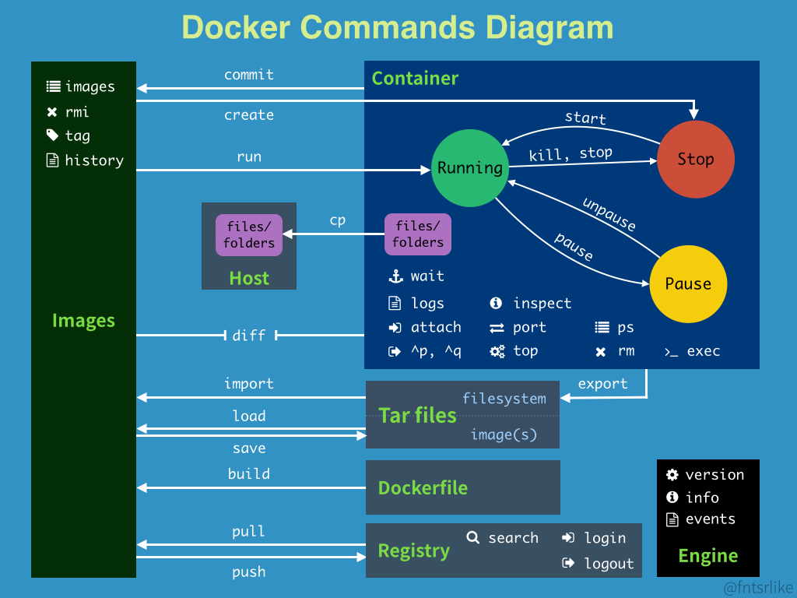

# Docker笔记

> 一图流说明（来自于@fntsrlike）



## Docker 安装

测试运行
```sh
docker run hello-world
docker pull hello-world
```


## docker 登录 于 token

To use the access token from your Docker CLI client:

这里登录的时候，需要设置代理

```sh
export HTTP_PROXY=http://127.0.0.1:7777 
export HTTPS_PROXY=http://127.0.0.1:7777
```

1. Run
```bash
docker login -u bourne7
```

2. At the password prompt, enter the personal access token.
```bash
Your Token
```

位置在 `cat ~/.docker/config.json` 的 auths 下面。用了 Base64 加密。


## Docker 拉取镜像设置代理

docker pull 和 docker build/run 的方式不一样

docker pull 的代理被 systemd 接管，所以需要设置 systemd

```sh
sudo mkdir /etc/systemd/system/docker.service.d
sudo vim /etc/systemd/system/docker.service.d/http-proxy.conf

[Service]
Environment="HTTP_PROXY=http://127.0.0.1:7777"
Environment="HTTPS_PROXY=http://127.0.0.1:7777"

# 然后运行
sudo systemctl daemon-reload
sudo systemctl restart docker
```


可以通过`sudo systemctl show --property=Environment docker`看到设置的环境变量。

## Docker 容器内部代理

建议使用

```
docker run -p 1080:1080 .....
export ALL_PROXY='socks5://127.0.0.1:1080'
```

如果遇到了基础镜像引入的外部的一些找不到来源的环境变量，就可以手动覆盖

```yml
version: '3'

services:
  open-webui:
    image: ghcr.io/open-webui/open-webui:main
    container_name: open-webui
    restart: always
    ports:
      - "3000:8080"
    environment:
      - HF_HUB_OFFLINE=1
      - OLLAMA_BASE_URL=http://127.0.0.1:11434
      - http_proxy=
      - HTTP_PROXY=
      - https_proxy=
      - HTTPS_PROXY=
      - no_proxy=
      - NO_PROXY=
    volumes:
      - ./data:/app/backend/data
```

后来找到了是这个引起的。这个是在每次容器被构建的时候被注入的。不建议使用这个设定，比较隐蔽。

```json
// cat ~/.docker/config.json
{
    "proxies": {
        "default": {
            "httpProxy": "http://127.0.0.1:7777",
            "httpsProxy": "http://127.0.0.1:7777",
            "noProxy": "*.test.example.com,.example.org,127.0.0.0/8"
        }
    }
}
```

## Image操作

* 停止所有的container并且删除所有镜像：
```
docker stop $(docker ps -a -q)
docker rm $(docker ps -a -q)
docker rmi $(docker images -q)
```

* 删除指定Image
```
docker images
docker rmi image_id
```

* 如果遇到了 \<none>:\<none> 类型的 untagged images 应该如何删除
关于这种类型的镜像的产生，有2种原因，可以在这个网页上面找到解释：

> https://www.projectatomic.io/blog/2015/07/what-are-docker-none-none-images/

类型有2种，分别是旧版的 images 和 被现有自定义镜像依赖的旧版 images。都可以通过ID来删除：
```
 sudo docker rmi 8eccc77fd8d0
```


## docker top

可以用于寻找 容器 对应的系统 PID

docker top container_name

## docker mount 和 docker volume

Differences between -v and --mount behavior
Because the -v and --volume flags have been a part of Docker for a long time, their behavior cannot be changed. This means that there is one behavior that is different between -v and --mount.

If you use -v or --volume to bind-mount a file or directory that does not yet exist on the Docker host, -v creates the endpoint for you. It is always created as a directory.

If you use --mount to bind-mount a file or directory that does not yet exist on the Docker host, Docker does not automatically create it for you, but generates an error.

You cannot mount root in container to host. 

经过测试：无法将容器的根目录映射到外面。

猜测原因：
* 在创建容器的时候，目录映射会将容器内部的某个目录映射到外部，并且采用外部的值。
* 如果映射文件的话，则是会单向的在创建容器的时候，将外面的文件映射到容器里面。

我认为为了容器的映射方便，最好将所有的非基础镜像的内容，都放到非根目录里面，比如可以放到 /data 里面去，然后映射出来，这样就方便许多了。

> https://forums.docker.com/t/mount-container-volume-root-folder/38265/3
If you could successfully run docker run -v /host/path:/ image then it would cause the contents of /host/path to be the only thing visible in the container; it would be the container’s root. That is, you can mount things into the container but not out.

## ports and volumes

内外映射问题。 都是由外到内，即左外右内。

The following command will create a directory called nginxlogs in your current user’s home directory and bindmount it to /var/log/nginx in the container:

docker run --name=nginx -d -v ~/nginxlogs:/var/log/nginx -p 5000:80 nginx

端口也是一样的：外-内

```
services:
  myapp1:
    ...
    ports:
    - "3000"                             # container port (3000), assigned to random host port
    - "3001-3005"                        # container port range (3001-3005), assigned to random host ports
    - "8000:8000"                        # container port (8000), assigned to given host port (8000)
    - "9090-9091:8080-8081"              # container port range (8080-8081), assigned to given host port range (9090-9091)
    - "127.0.0.1:8002:8002"              # container port (8002), assigned to given host port (8002) and bind to 127.0.0.1
    - "6060:6060/udp"                    # container port (6060) restricted to UDP protocol, assigned to given host (6060)
```

