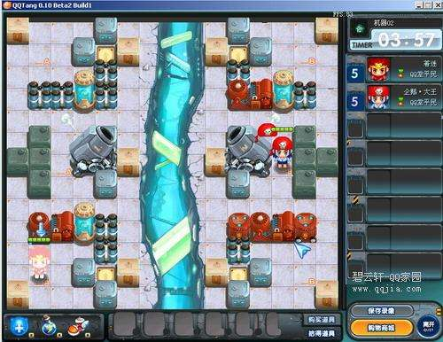

# 游戏回忆录

本文主要说的是笔者与游戏的一些故事，纯当回忆录。现在不写的话，怕以后忘记了。。

### 小霸王与红白机
当年小学一年级的时候，隔壁家小伙伴买了一个「小霸王学习机」这个东西实在是太魔幻了，在一个键盘的外表下，拥有神奇的玩游戏功能，只是那个时候不知道这是个山寨版的任天堂游戏机，貌似快到高中了我才听说了“任天堂”这个名字。。当时印象深刻的几个游戏就是：坦克大战，超级玛丽，小蜜蜂，掘金者，功夫，冒险岛，魂斗罗，热血足球。游戏显然没有今天这么多，在没有网络，没有手机的年代，跑去小伙伴家里玩游戏机成为了我最喜欢的事情。还记得经常在玩的时候会因为接触不良，我们会在游戏机的顶部拍一下，然后会把黄色的卡带拔出来吹口气，摩擦上面的金属条，然后再插回去，这样一来的话能解决大部分的卡顿问题。。

几天前在微博上面看到一个关于超级玛丽的记忆，那个微博的内容是你哥哥关于超级玛丽的记忆就是红色的超级玛丽，而我关于超级玛丽的记忆就是那个绿色的超级玛丽。的确是这样的。因为当时每次我去小伙伴家里玩超级玛丽的时候，我永远是玩那个副手柄，我永远是玩那个绿色的超级玛丽。。

### 接触到了各种游戏
后来年纪大了一些，开始去学校附近的游戏厅。那个时候的游戏厅我记得是5角3个币，一元7个币。最火的游戏当然是拳皇和三国，然而这2个我都玩不好。。比较喜欢玩的是合金弹头1和2，有个扔香蕉打人的游戏，还有雪人兄弟，棒球小子。去游戏厅也去的不多，主要是没钱。。再到后来有了网吧，第一次玩的电脑游戏应该是暴力摩托，极品飞车2。后来比较火的星际争霸和红警都没怎么玩，导致我一直对即时战略类型的游戏没啥兴趣，包括魔兽争霸也玩不好。但是那个时候却有一个游戏让我非常喜欢：反恐精英。在此期间业基础到了 GBA，GBASP 这2个在我看来很好玩但是又属于没钱玩的游戏机。。所以这2个游戏机我看小伙伴玩的比较多。。

再到了初中的时候，有了泡泡堂，当时我没玩。。直到腾讯除了个 QQ 堂，我开始玩 QQ 堂。。原因也是同学们都有了 QQ 号，直接用 QQ 号登陆就能玩，那个时候我的好朋友买了个新电脑，所以托他的福啦~ QQ 堂在今天看来我仍然觉得是个很难玩的游戏。。因为里面的人都是各种勾心斗角。。我自己的等级貌似是“熟练拌糖工”。。如果我没记错的，游戏里面也有很多模式，那种大家都在一个平面放泡泡，炸其他人的那种是我死得最快的，但是向里面的“比武”，“抢包山”等都差不多是这种模式。。所以我比较喜欢玩的是足球模式和 机械模式，尤其是机械模式我玩的比较好，大概是下面这个样子的：

图片来源于网络

左右两边的人不能越过去，但是可以朝对面放泡泡。还有各种比如：四个泡泡的“长龙”，围起来的四个泡泡的“天牢”。。游戏里面也有各种道具，但是我没买过，感觉大部分都是装饰用的，有些能有点作用但是貌似在机械模式里面大家都差不多。。所以当时我记得我还是2w 多分的时候，打败过一个50多 W 分的老鸟。。。非常有成就感。我记得当时最高等级的叫做“酷比大天使”，“创世之神”。这样的称呼。。虽然这个游戏的等级没啥用，但是那时却是各种羡慕。。还会在 ku6（没错，这个网站很早就有了。。）上面看那些大神玩的。。

另外还有跑跑卡丁车。。这个玩的不算多，当时觉得挺难玩的。当时其他一些比较火的网游我也没接触。所以一直到今天，我都没有玩过网游。。（这里是指会有等级积累，装备升级的网络游戏）包括魔兽世界我也一直没玩过。

再到后来，有隔壁班的人搞到了 PSP。。我看到那游戏画面，简直是震惊了！这不就是将电脑缩小放到了手中么！？好像要啊o(╯□╰)o 我知道自己是肯定不可能得到这样一个神器了，便寄希望于几个玩得好的朋友。后来终于我最好的朋友买了一个 psp1000，当时我第一次玩的时候简直不要太震撼！比当年的 GBA 来的震撼多了。。在我的排行中，PSP 仅次于 iPod nano 3对我的震撼，高于后来的 iPhone4。当然我也不能就这样白玩人家的游戏机啊。。所以我开始帮小伙伴钻研如何下载游戏。。由于一直玩的是破解版。。我到现在都还没有摸到过 PSP 的 UMD。。。后来就买了一些杂志，研究破解 PSP，知道了 Dark Alex，知道了大名鼎鼎的 M33小组，知道了神奇电池，知道了开机的同时按下同侧的顶部键可以进去系统菜单，然后查字典去作死调整里面的参数。。那个时候，一台 PSP 能让几个人讨论好久。。至于当时上面的游戏么。。我玩的都比较零散，怪物猎人2玩的是同学的存档，其他的印象深刻的游戏就是高达，火影忍者，扣杀网球，合金弹头5还是6。。

电脑游戏方面，反恐精英继续在玩，玩的是1.5，玩的比较多的是仓库救人质图，太大的图往往玩不好。当然由于也有学习的压力，在高考前都停了很长一段时间没玩游戏。。

### DOTA
讲道理，由于我不是玩魔兽的玩家，所以理论上我是接触不到 dota 的。只是到了大学以后，宿舍4个人里面3个人都是玩3C的，那段时间我们班没玩都在讨论是局域网联机玩实况8还是反恐还是3C，后来大家就一起玩 dota 了。。dota 这个游戏我一开始一直没玩，主要是我不会，而且发现是在是太难了。但是应该是6.5几还是6.6几。。当时连补兵都不会。慢慢的开始练习，在我们班第一高手的指挥下，我开始上手 dota，从补兵，到快捷键编队，主要是编商店，这样能每次买东西的时候都不离开视线。然后是英雄技能快捷键（室友改键器的，但是我只用来改了物品栏，技能都没改）。然后是合成物品的清单，一开始都大声问队友先买什么再买什么，合成路径是啥。大约半个学期才慢慢变得上手了。。补兵也不太坑了。记得当时第一个玩的英雄是剃刀，同学让我玩的，我问为什么，他说这个英雄的招只要放出来就有伤害，不用担心放不中。我觉得很有道理。然后就是他让我每个英雄都要出先锋盾，理由是：出门就买了圆盾，然后路边就买了875，最后1100的球，合成平缓，还能撑血回血抵挡伤害，简直就是第一神器！所以后来我即使玩火枪都是先出先锋盾的。。在玩会了剃刀以后，玩其他英雄的顺序应该是：神灵，斧王，火枪，血魔，沉默，白牛，猴子，幽鬼，PA，斯温。。。每个英雄都玩的各种欢乐。

当时我们班大约有20个男生打 dota，所以每晚10人内战肯定开的起来，有时候还要玩6v6这种非常规地图。。那时候每次打完，大家还会聚到一起讨论每个人的表现，要改进的地方。。非常正式。。受限制与学校网络，每次在11平台上面打，都是只能打教育网。然后天梯分数一直不高，最高去过1300。。在 dota1时代，我玩的最好的英雄就是血魔，假腿刃甲双刀血魔，突出一个干！

后来有了 dota2，我也在玩，那个时候是2012年，刚内侧，dota2内侧码很值钱，180元买了3个，后来 V 社送了很多限区码给我，我都拿到论坛里面送掉了，一堆人赞我。。。再后来 V 社发血精石的时候，我有32格血精石，代表着我送了32个邀请码给别人。。dota2内侧的时候并不稳定，经常断线，老外居多，基本都是说英语的。好在游戏英语不复杂，几个单词就能搞定，什么 gank top! help！go！这几个词够用了。如果遇到了要骂人的时候那就只能 fvck 相对了。。再后来是 ti3的时候，买了小绿本，开始玩 dota2饰品，各种坑。那个时候买钥匙，去 dota2lounge 上面和老外讨价还价，交易物品，在贴吧交易各种装备，玩的不亦乐乎。再到后来被人骗过一次后，就没玩饰品了。。在此期间也有玩 csgo，也是2012年开始玩的，一开始是没有饰品的，后来才有。后来也买过一些刀的皮肤啊什么的，后来 dota2饰品退坑的时候就一起卖掉了。。csgo 就是反恐精英全球攻势，是一款很优秀的射击游戏。我玩的一般吧，最高打到过单 AK 等级。csgo 玩起来太累了，主要是注意力过于集中。。

再到后来，随着和我一起玩的同学们都一个个不在线了。这种非常消耗时间和精力的游戏我就没有在继续玩了。。dota 这个游戏么，我觉得是非常优秀的一个游戏，从几兆大小的一个地图开始，构建出了一个完整的游戏类型：moba，后来诞生了 lol 和王者荣耀。lol 我没玩，王者荣耀玩过一阵子，看得出来游戏都在一代一代进化，变得越来越亲民，越来越容易上手，玩的人也越来越多。作为当年的 dota1开始玩的老玩家，我觉得这是个很正常的发展历程。当年大家的娱乐没有这么多，网不快，电脑不强，只能玩2003年的魔兽争霸上面的一款叫做 dota的地图，现在的手机游戏画面都比当年的电脑画面好多了。。另外一个就是难度的降低。我自认为我游戏天赋不算差，但是学 dota1也学了很久，但是现在的人上手王者荣耀，估计最多一小时就够了。。关于 moba 游戏的发展史其实不长，因为这是个很年轻的游戏类型，lol 和王者荣耀将这种游戏带给了更多的人。很多网上的，贴吧的人都会相互攻击对方玩家，比如 dota 和 lol 的互相撕逼，我觉得，作为一个游戏，无论是免费的还是收费的，无论是什么平台的，能让更多的人玩到，就是一款好的游戏。即使一款游戏最后停服了，也会有很多人保留着当年玩过它的记忆，很久以后，任何游戏都会被更新的游戏淘汰，以后的人当然无法体会以前的人玩游戏时候的那种心情，但是与朋友们玩游戏的那种快乐，却是每一代人都会拥有的。随着年龄的增长，每个人也迟早和游戏说再见，最难忘的一定不是具体某款游戏，而是当年和我一起打游戏的那个宿舍，那个小伙伴，那群同学。

### 主机游戏
我把其他我玩过的游戏都归结在这里吧。主机游戏，是我读书的时候很少接触的游戏，主要是因为买个只能玩游戏的机器放家里，一定会被父母暴揍一顿。。关于主机游戏，当年第一次听说 PS3的时候，是被它强大的技能震撼到了。当时有一本杂事叫做《数字通信》，里面详细介绍了一款叫做《GT 赛车》的游戏和一款叫做 PS3的游戏机，让我感到无比震撼，当然，当时的家庭条件是不可能让我买游戏机的，况且当时根本不知道大作都是要60美元一个。还以为买个游戏机回来就能免费玩所有游戏了。。所以，对于所有想买游戏机的玩家来说，一定要记住，买游戏的钱会远远大于你买游戏机的钱，所以，要谨慎的对待自己的选择，毕竟游戏都不便宜。。当然土豪除外。。

后来我买的杂志里面有了各种游戏介绍，我还记得当年的显卡杀手“鬼泣4”，我觉得但丁那帅气的杀马特造型很酷炫，但是自己的电脑又带不起来，于是我认为主机的性能很强大，然而后来发现只是主机的游戏优化的实在是太好了。。一个2005年发售的 xbox360，竟然能流畅运行最新的使命召唤，实在是让我惊讶，要知道那个时候的电脑硬件更新是非常快的，我当时刚对电脑硬件有一定的研究，老师用电脑配置去比较永远不能升级的主机，顿时觉得主机是个很有黑科技的物体。。

大学期间的电脑是一个宏碁笔记本，显卡是5650，这个显卡在当时看来，就是2个字：牛逼！能在我的笔记本分辨率1366*768的屏幕里面流畅运行当时绝大部分游戏。那个时候每次玩一个游戏，就是去游戏里面设置好视频参数，什么几倍抗锯齿啊，什么动态模糊啊，同步锁定啊等等，大概也都知道是什么意思了。当时基本上在 PC 有的大型游戏或者好玩的游戏我都玩过了，当然不一定都是很仔细的玩过，大部分都是简单难度通关依稀就完事，因为没啥时间，但是又对那些精美的过场 CG 还有无比华丽的游戏画面非常喜欢。。所以很多都是简单玩了一下。

### Xbox One
15年国庆节买的废渣6限定版。非常喜欢的一个主机。在当今消费电子品被淘汰这么快的情况下，游戏机真的是一种长寿命的产品。着这个上面到目前已经玩到了11000点成就点了。也有很多优秀的游戏。现在基本还在玩的就是 COD12 ，光环，战争机器和废渣系列了。